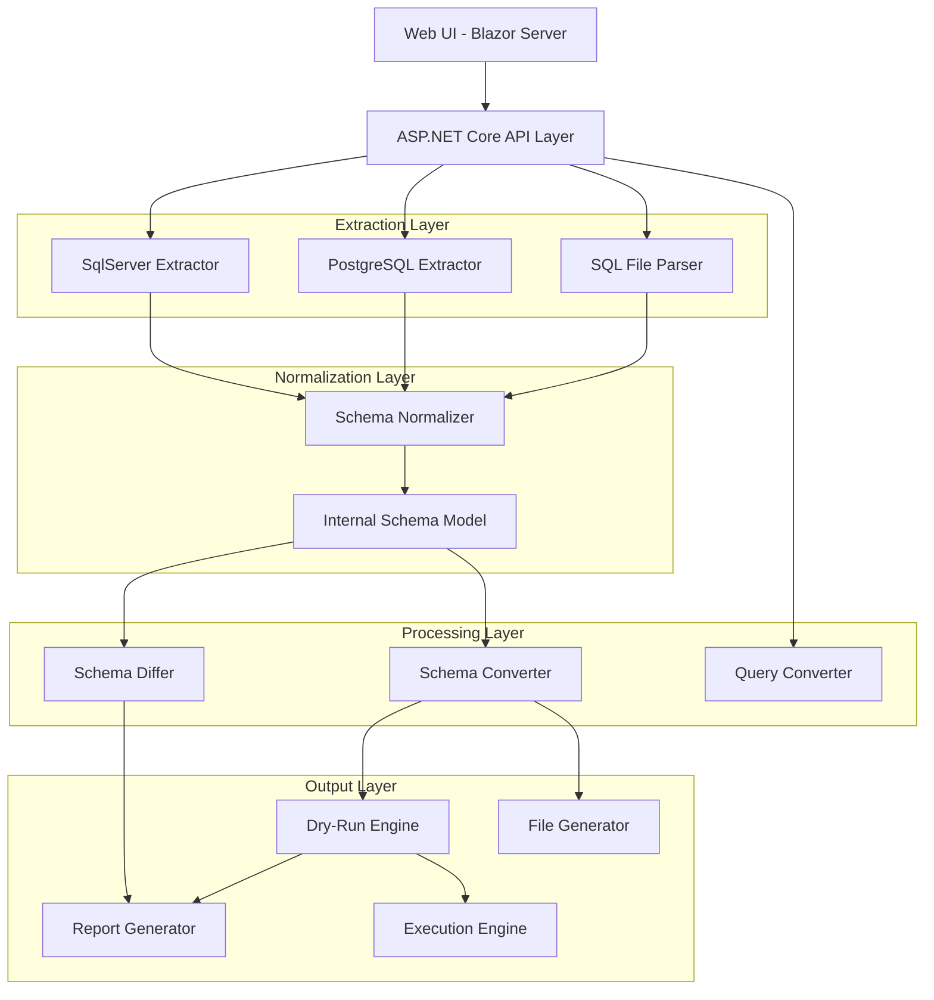
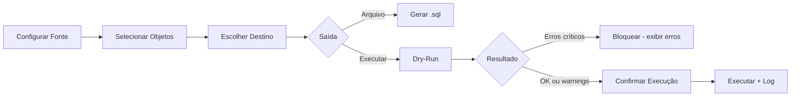
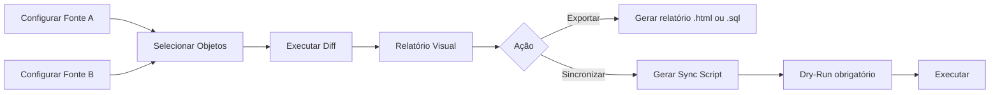

# Database Schema Converter & Comparator

## Visão Geral

Aplicação web ASP.NET Core publicada via IIS no EC2. Cobre três eixos principais: **conversão de schema**, **comparação de schema** e **utilitário de query**. Toda operação que toca um banco real exige dry-run com confirmação explícita.

---

## Arquitetura



---

## Stack Tecnológica

- **Backend**: ASP.NET Core 8 (C#)
- **Frontend**: Blazor Server
- **Parser T-SQL**: `Microsoft.SqlServer.TransactSql.ScriptDom` (NuGet oficial Microsoft)
- **Parser PostgreSQL**: `pg_query.NET`
- **SQL Server client**: `Microsoft.Data.SqlClient`
- **PostgreSQL client**: `Npgsql`
- **Deploy**: IIS no EC2 Windows

---

## Modelo Interno de Schema (Internal Schema Model)

Representa qualquer banco de forma agnóstica de dialeto. É o contrato central entre todos os módulos.

```
SchemaModel
├── Tables[]
│   ├── Name, Schema
│   ├── Columns[] → Name, DataType, IsNullable, DefaultValue, IsIdentity
│   ├── PrimaryKey
│   ├── ForeignKeys[]
│   ├── Indexes[]
│   └── Triggers[]
├── Views[]        → Name, Schema, Definition (SQL original)
├── Procedures[]   → Name, Schema, Definition (SQL original)
├── Functions[]    → Name, Schema, Definition (SQL original)
└── Sequences[]
```

---

## Módulos Detalhados

### 1. Extraction Layer

**Fontes suportadas:**
- Conexão direta SQL Server (string de conexão)
- Conexão direta PostgreSQL (string de conexão)
- Arquivo `.sql` (T-SQL ou PostgreSQL DDL)

**Granularidade de seleção (por fonte):**
- Tabelas: todas ou seleção individual
- Views: todas ou seleção individual
- Stored Procedures: todas ou seleção individual
- Functions: todas ou seleção individual
- Indexes: incluir/excluir (toggle)
- Triggers: incluir/excluir (toggle)

**Via conexão**: queries em `INFORMATION_SCHEMA` + catálogos do sistema (`sys.*` para SQL Server, `pg_catalog` para PostgreSQL).

**Via arquivo**: parsing com `ScriptDom` (T-SQL) ou `pg_query.NET` (PostgreSQL), gerando AST e depois mapeando para o modelo interno.

---

### 2. Conversion Engine

**Direções suportadas:**
- SQL Server → PostgreSQL
- PostgreSQL → SQL Server

**Mapeamento de tipos (configurável):**

| SQL Server | PostgreSQL |
|---|---|
| `NVARCHAR(n)` | `VARCHAR(n)` |
| `DATETIME` / `DATETIME2` | `TIMESTAMP` |
| `BIT` | `BOOLEAN` |
| `UNIQUEIDENTIFIER` | `UUID` |
| `IDENTITY(1,1)` | `GENERATED ALWAYS AS IDENTITY` |
| `MONEY` | `NUMERIC(19,4)` |
| `IMAGE` / `VARBINARY(MAX)` | `BYTEA` |
| `NTEXT` / `TEXT` | `TEXT` |

O mapeamento é definido em arquivo de configuração JSON editável pelo usuário na própria UI.

**Conversão de corpo de SP/Functions**: "best-effort" — converte o que é mapeável automaticamente e insere comentários `-- [REVIEW REQUIRED]` nos trechos que exigem revisão manual (ex: cursors, hints, PL/pgSQL específico).

---

### 3. Schema Differ

Compara dois `SchemaModel` (qualquer combinação de fontes):

- SQL Server vs SQL Server
- PostgreSQL vs PostgreSQL
- SQL Server vs PostgreSQL (e vice-versa)
- Arquivo vs conexão
- Arquivo vs arquivo

**Resultado do diff:**

```
Diff Report
├── Tables
│   ├── Only in Source[]
│   ├── Only in Target[]
│   └── Different[]
│       └── Column diffs, index diffs, constraint diffs
├── Views
│   ├── Only in Source[]
│   ├── Only in Target[]
│   └── Definition changed[]
├── Procedures / Functions / Triggers
│   └── (mesma estrutura)
└── Generated Sync Script (opcional)
```

O sync script gerado aplica as diferenças do source no target.

---

### 4. Dry-Run Engine

Obrigatório antes de qualquer execução direta.

**SQL Server**: `BEGIN TRANSACTION` → executa statements → `ROLLBACK`. Captura erros por statement.

**PostgreSQL**: `BEGIN` → executa statements → `ROLLBACK`. Captura erros por statement.

**Relatório de dry-run:**
- Statements que passariam (verde)
- Statements com erro (vermelho) → tipo de erro, linha, objeto
- Lista de objetos que seriam criados/alterados/removidos
- Contagem: X de Y statements válidos

Execução real só é habilitada após dry-run sem erros críticos. Warnings permitem prosseguir com confirmação.

---

### 5. Query Converter (utilitário)

Conversão avulsa de snippets T-SQL ↔ PostgreSQL SQL. Input/output em text area na UI. Regras baseadas no mesmo engine de conversão do Schema Converter.

---

### 6. File Generator

Gera arquivo `.sql` do script convertido ou do sync script do diff. UTF-8, com header de metadados (data, fonte, destino, objetos incluídos).

---

## Fluxos Principais

### Fluxo: Conversão



### Fluxo: Comparação



---

## Estrutura de Projeto

```
DatabaseTool/
├── DatabaseTool.sln
├── src/
│   ├── DatabaseTool.Web/              ← Blazor Server + Controllers
│   │   ├── Pages/
│   │   │   ├── Converter/
│   │   │   ├── Comparator/
│   │   │   └── QueryConverter/
│   │   └── wwwroot/
│   ├── DatabaseTool.Core/             ← Modelos, interfaces, lógica de negócio
│   │   ├── Models/                    ← SchemaModel e todos os tipos internos
│   │   ├── Interfaces/                ← IExtractor, IConverter, IDiffer, etc.
│   │   ├── Conversion/                ← TypeMapper, DDLConverter, QueryConverter
│   │   ├── Diff/                      ← SchemaDiffer, DiffReport
│   │   └── Execution/                 ← DryRunEngine, ExecutionEngine
│   ├── DatabaseTool.SqlServer/        ← Extractor SQL Server, ScriptDom parser
│   └── DatabaseTool.PostgreSQL/       ← Extractor PostgreSQL, pg_query parser
└── tests/
    ├── DatabaseTool.Core.Tests/
    ├── DatabaseTool.SqlServer.Tests/
    └── DatabaseTool.PostgreSQL.Tests/
```

---

## Ordem de Desenvolvimento (Sprints)

### Sprint 1 — Fundação
- Criar solution e projetos
- Definir `SchemaModel` completo (modelos internos)
- Implementar `IExtractor` interface
- Extractor SQL Server via conexão (tabelas + colunas)
- Extractor PostgreSQL via conexão (tabelas + colunas)

### Sprint 2 — Extraction Completa
- Extractor via arquivo `.sql` (ScriptDom + pg_query)
- Adicionar views, procedures, functions, triggers, indexes aos extractors
- Granularidade de seleção de objetos

### Sprint 3 — Conversion Engine
- TypeMapper configurável (JSON)
- DDL Converter SQL Server → PostgreSQL
- DDL Converter PostgreSQL → SQL Server
- Conversão best-effort de SP/Functions com marcação de review

### Sprint 4 — Diff Engine
- SchemaDiffer (compara dois SchemaModel)
- DiffReport model
- Geração de sync script a partir do diff

### Sprint 5 — Execution Layer
- DryRunEngine (SQL Server e PostgreSQL)
- ExecutionEngine com log statement-by-statement
- FileGenerator

### Sprint 6 — UI (Blazor)
- Página: Converter
- Página: Comparator
- Página: Query Converter
- Componente de seleção granular de objetos
- Componente de relatório de diff
- Componente de dry-run report + confirmação

### Sprint 7 — Deploy & Config
- Configuração IIS / EC2
- TypeMapper editável via UI
- Logging de auditoria (quem converteu/executou o quê, quando)
